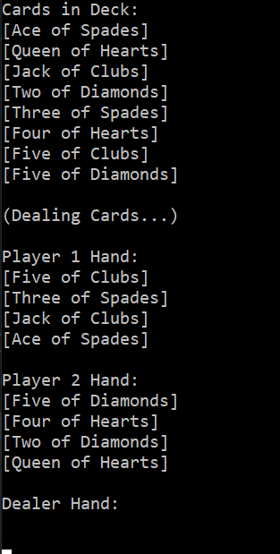
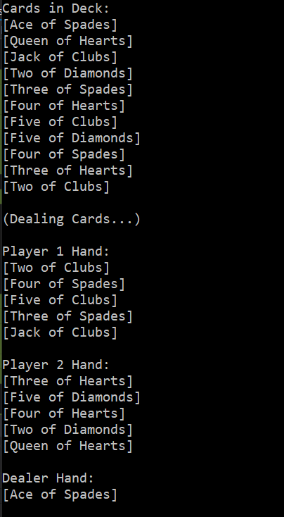

# Lab07-Collections
* Create a custom generic collection named `Deck<T>`.
* As we learned, under the hood, generic collections are arrays. Utilizing this concept, create a new generic collection (`Deck<T>`) that dynamically resizes an array for all the specified methods described below. (*Do not use a collection within your `Deck` class).
* Your Generic collection should hold Cards. (You will need to create a custom Card class)
* Create an Enum to hold the different card suits (Hearts, Diamonds, Spades, Clubs)
* The methods within your Deck class should contain at minimum:
  * Add
  * Remove
  * Count (the total number of cards in the deck)
* In your `Program.cs` have a method named `Deal` that gets called from `Main` that evenly distributes the deck of cards amongst 2 players decks. the Dealer Deck should keeps any remaining cards (if any). Output to the console the cards each player has and what the Dealer Deck has kept.
* When running your application, it should activate a console that outputs an example for each of the custom methods within your deck. It should show what cards were added to the deck, information about what card was removed, and then proof it is gone, as well as a final count of the number of cards without any direct code manipulation from the grader.

### Screenshots

